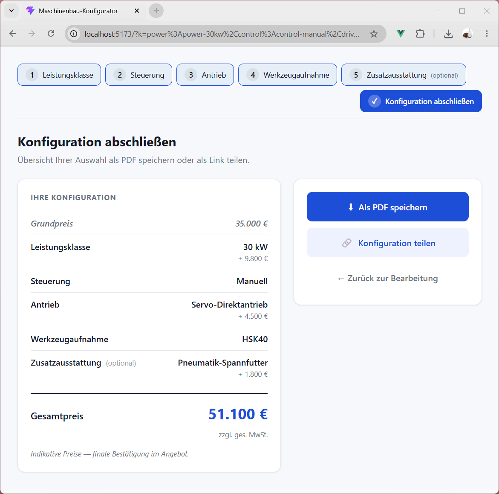

# Maschinenbau-Konfigurator

Vue 3 Web Component für einen einbettbaren, mehrsprachigen Produkt-Konfigurator —
5-Schritt-Auswahl, Live-Preis, Regelwerk und clientseitiger PDF-Export. Kein Backend,
alles auf Fixtures.

[](https://dc-deal.github.io/vue-product-configurator/)
[](https://github.com/dc-deal/vue-product-configurator/actions/workflows/test.yml)
[](LICENSE)

**▶ Live-Demo:** https://dc-deal.github.io/vue-product-configurator/



> **Stand:** `v1.0.0`. Versionierungs-Konvention siehe Konzept Anhang C.4.
> Änderungshistorie unter [`CHANGELOG.md`](CHANGELOG.md).

## Worum es geht

Endkunden konfigurieren eine Maschine über fünf Schritte (Leistung, Steuerung,
Antrieb, Werkzeugaufnahme, optionales Zubehör); pro Auswahl aktualisiert sich der
Preis live, am Ende steht eine PDF-Zusammenfassung als Anfrage-Grundlage. Die
Komponente ist als Custom Element (`<mbk-configurator>`) mit Shadow-DOM-Isolation
gebaut und in jede bestehende Website (z. B. WordPress) einbettbar.

Ausgangs-Problemstellung: [`docs/problemstellung.md`](docs/problemstellung.md) ·
Architektur & Trade-offs: [`docs/konzept.md`](docs/konzept.md).

## Quick Start

```bash
npm install
npm run dev          # Dev-Server auf http://localhost:5173
npm test             # Vitest einmalig
npm run type-check   # TypeScript ohne Emit
npm run build        # Produktions-Bundle nach dist/
```

## Verfügbare Scripts

| Script               | Zweck                               |
| -------------------- | ----------------------------------- |
| `npm run dev`        | Vite Dev-Server mit HMR             |
| `npm run build`      | Type-Check + Vite-Produktions-Build |
| `npm run preview`    | Lokale Vorschau des Builds          |
| `npm test`           | Vitest einmalig (CI-Modus)          |
| `npm run test:watch` | Vitest im Watch-Modus               |
| `npm run coverage`   | Vitest + Coverage-Report (v8, text + html unter `coverage/index.html`) |
| `npm run type-check` | TypeScript strict, kein Code-Emit   |
| `npm run format`     | Prettier auf `src/` und `tests/`    |

## Verzeichnisstruktur (Top-Level)

```
src/
├── components/       Vue-Komponenten (Shell, Step, Summary, Review)
├── stores/           Pinia-Store (Konfigurations-State, Regelwerk)
├── composables/      useUrlState, useI18n, usePdfExport
├── services/         productService (v1: Fixtures, v2: API)
└── data/             fixtures, translations, types
tests/                Vitest-Tests
docs/                 Problemstellung, Konzept, Code-Guidelines
```

## Tests & Coverage

```
Test Files  1 passed (1)
Tests      45 passed (45)
```

| Suite                                    | Tests | Quelle       |
| ---------------------------------------- | ----- | ------------ |
| Smoke + Fixture-Struktur                 | 11    | eigene       |
| Store Derived State + Navigation + Reset | 12    | eigene       |
| **Pflicht-Tests (Konzept B.6)**          | 8     | spezifiziert |
| Szenario-Tests (Konzept B.7)             | 4     | spezifiziert |
| Retroaktive Invalidierung                | 3     | eigene       |
| URL-Replay-Positionierung                | 3     | eigene       |
| URL-State Unit-Tests                     | 4     | eigene       |

**Coverage** (`npm run coverage`, v8-Provider, harte Thresholds in `vitest.config.ts` — 80 % Lines/Stmts/Funcs, 70 % Branches):

| Modul                          | Lines      | Stmts      | Branches   | Funcs   |
| ------------------------------ | ---------- | ---------- | ---------- | ------- |
| `stores/configurator.ts`       | 93,81      | 89,65      | 78,26      | 100     |
| `services/productService.ts`   | 100        | 100        | 100        | 100     |
| `composables/useI18n.ts`       | 100        | 100        | 100        | 100     |
| `composables/useUrlState.ts`   | 100        | 96,42      | 85,71      | 100     |
| **All files**                  | **95,16**  | **91,44**  | **81,05**  | **100** |

**Bewusst nicht abgedeckt** (`vitest.config.ts > coverage.exclude`):

- `src/components/**.vue` — Konzept B.6 spezifiziert Store-Level-Tests; Komponenten-Verhalten wird durch die Store/Composable-Suite + manuellen Browser-Walkthrough validiert
- `src/composables/usePdfExport.ts` — pdfmake braucht echtes Browser-DOM (Blob, Canvas); in jsdom nicht ausführbar
- `src/data/{fixtures,translations,types}.ts` — reine Daten/Interfaces, keine Laufzeit-Logik
- `src/{main.ts,App.vue}` — Bootstrap

HTML-Detail-Report nach `npm run coverage` unter `coverage/index.html`.

## Architektur & Entscheidungen

**Alle technischen Entscheidungen sind im Konzept-Dokument begründet:**
[`docs/konzept.md`](docs/konzept.md)

Querverweise:

- **§3.3** — Datenmodell (`ProductOption`, `Configuration`)
- **§3.7** — PDF-Engine (pdfmake) und DSGVO-Posture
- **§4** — i18n-Datenstruktur (flat array, text-IDs)
- **§5** — Preise: Live-Update, Netto, MwSt-Disclaimer
- **§3.8** — Theming, Shadow-DOM-Isolation, WCAG-AA, BFSG
- **Anhang B** — Build-Vorgaben (Projektstruktur, Store-API, 8 Pflicht-Tests)
- **Anhang C** — Engineering-Backlog (CI, Prettier, SemVer)

## PDF-Beispiele

Zwei direkt aus der App exportierte Beispiel-PDFs (DE + EN) liegen unter
[`pdf_output_examples/`](pdf_output_examples/). Die Dateinamen entsprechen
exakt dem `t('pdf.filename')`-Lookup der jeweiligen Sprache. Reproduzieren über
`npm run dev` → 5 Schritte durchklicken → „Als PDF speichern".

## Fixture-Daten ersetzen

Die Beispiel-Maschine „Werkzeugmaschine XR" liegt unter
[`src/data/fixtures.ts`](src/data/fixtures.ts) und ist durch echte
Produktdaten austauschbar. Übersetzungen in
[`src/data/translations.ts`](src/data/translations.ts).

## Lizenz

MIT — siehe [`LICENSE`](LICENSE).

Eingebettete Drittanbieter-Komponenten:

| Komponente | Lizenz | Verwendung |
| ---------- | ------ | ---------- |
| [pdfmake](https://github.com/bpampuch/pdfmake) | MIT | PDF-Export (clientseitig) |
| [Roboto](https://fonts.google.com/specimen/Roboto) (in pdfmake-VFS eingebettet) | Apache 2.0 | Schriftart im PDF |
| [Vue 3](https://vuejs.org/) · [Pinia](https://pinia.vuejs.org/) · [Vite](https://vitejs.dev/) | MIT | Frontend-Stack |

Alle Lizenzen sind kommerziell unkritisch. Im CSS referenziertes
`Inter` ist eine reine Font-Stack-Präferenz und wird nicht gebundelt — Fallback
auf `system-ui` wenn lokal nicht vorhanden.

## Autor

**Frank Krätzig** — Software Developer & Data Engineer, Region Karlsruhe
LinkedIn: https://www.linkedin.com/in/frank-kraetzig
